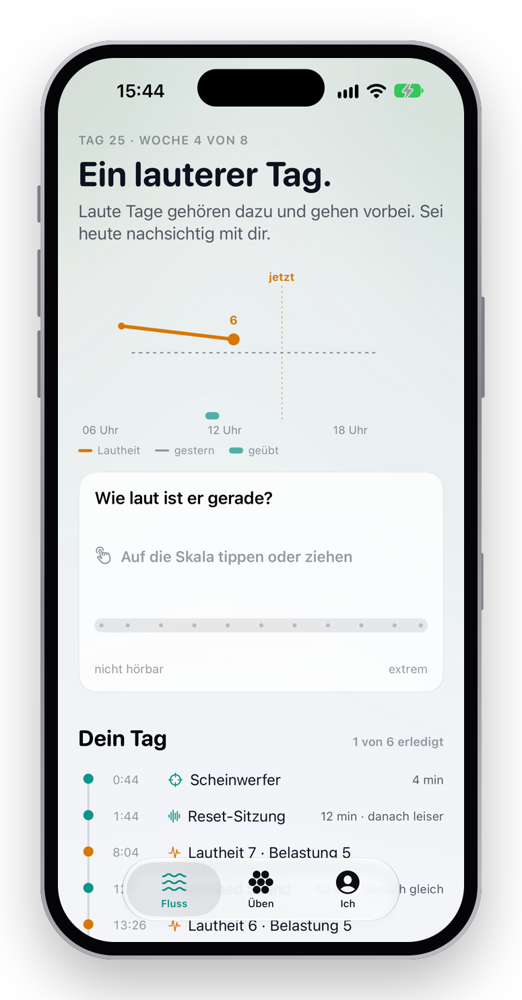
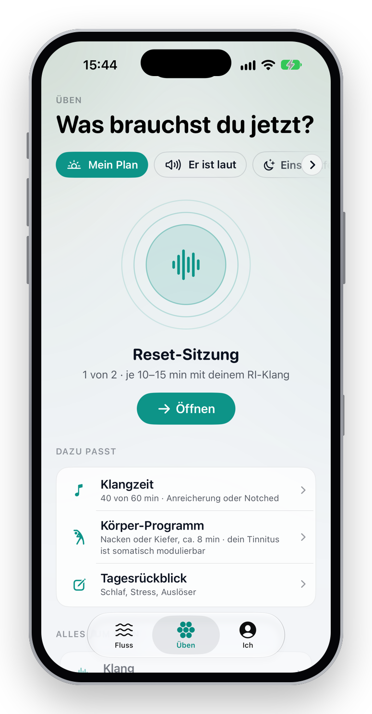
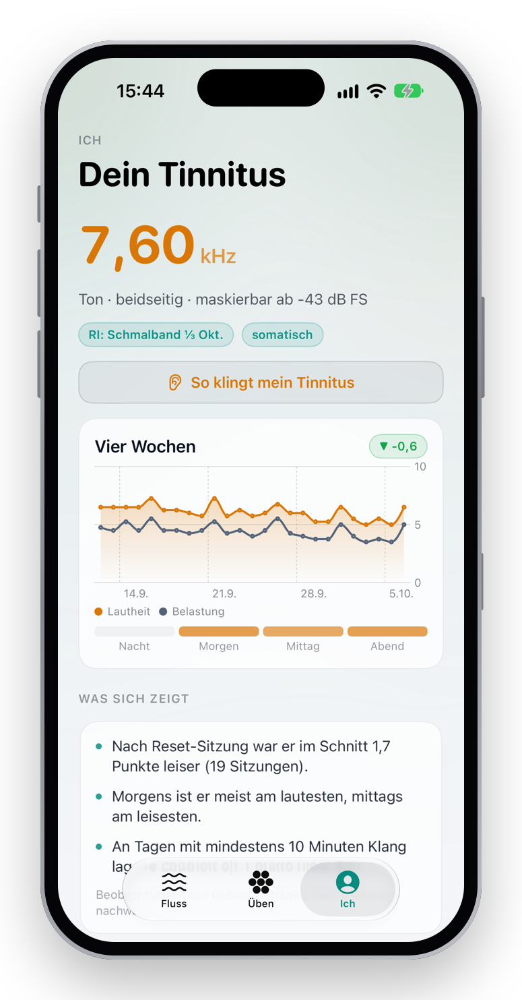
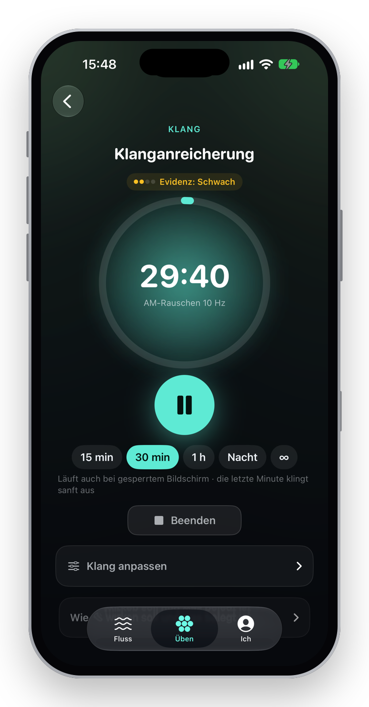
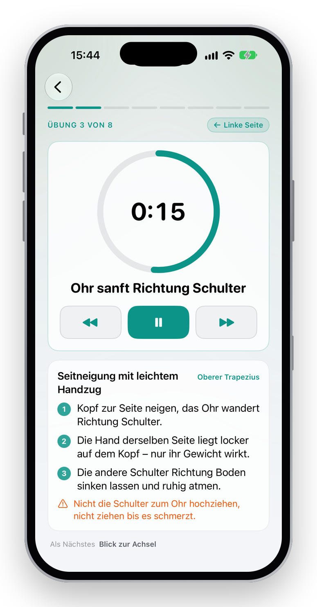
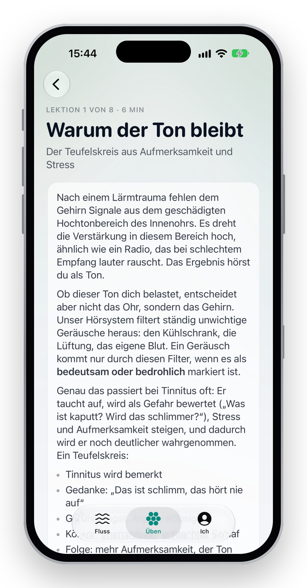
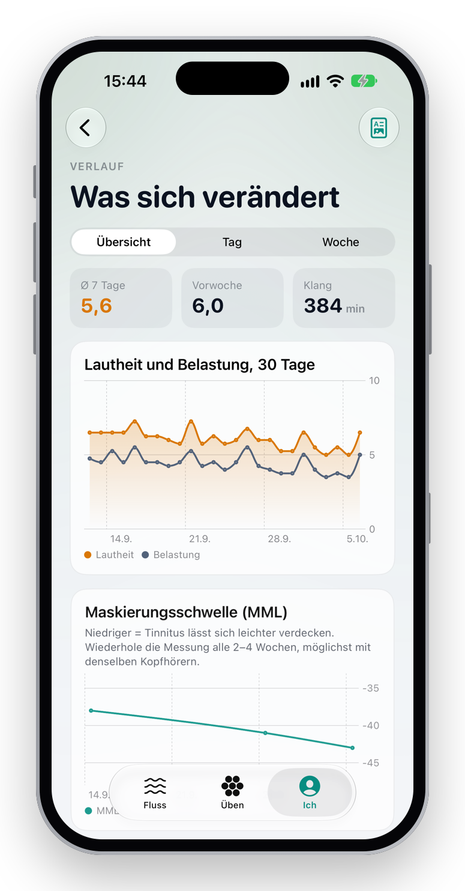
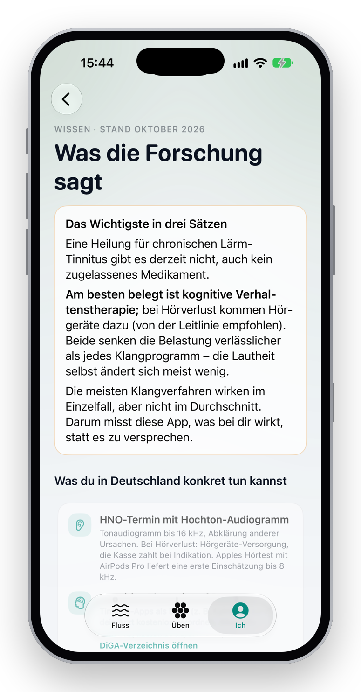

# Tinnitus Lab

**Messen, was bei dir wirkt – statt Heilung zu versprechen.** Ein ehrliches, privates Selbst-Experiment gegen
chronischen Tinnitus: native iOS-App (iPhone, Apple Watch) und Web-App.

→ **[Die Geschichte: vom Problem über die Forschung zur App](https://tobwil.github.io/solvemytinnitus/)** ·
[Web-App](https://tobwil.github.io/solvemytinnitus/app/) · [iOS-Code](ios/README.md)

<p align="center">
  
  
  
  
</p>

## Web-App

Installierbare Web-App (iPhone, Mac, jeder moderne Browser) für ein strukturiertes, evidenzbasiertes
Selbst-Experiment gegen chronischen, hochfrequenten Tinnitus. Keine Server, keine Konten: alle Daten
bleiben im Browser.

### Aufbau

| Bereich | Inhalt |
| --- | --- |
| **Heute** | 8-Wochen-Programm, Tagesaufgaben, 10-Sekunden-Check-in, Profil, Trend |
| **Labor** | Kopfhörer-Check · Tinnitus-Spektrum (Likeness-Rating) · Feinabstimmung auf Frequenz-Pad mit Oktaven-Check · Lautheit & Maskierungsschwelle · Hörprofil 0,5–16 kHz · Somatik-Check · verblindetes Residual-Inhibition-Labor (6 Stimuli) |
| **Klang** | Klanganreicherung (u. a. 10-Hz-AM-Rauschen), Reset-Sitzung mit dem besten RI-Klang, Notched Sound (auch eigene Musik), CR-Neuromodulation; Player mit Live-Spektrum, Timer, Vorher/Nachher-Bewertung; jedes Verfahren mit Evidenz-Kennzeichnung |
| **Kopf** | 8 Lektionen nach kognitiver Verhaltenstherapie, geführte Übungen (Atem, Aufmerksamkeit, Achtsamkeit, Muskelentspannung), Gedanken-Check, Notfallplan |
| **Verlauf** | Lautheit/Belastung, Maskierungsschwelle, „Was wirkt bei dir?“ mit Konfidenzbereich, Tageszeit-Muster, Auslöser, Tagesrückblick, Wochen-Check |
| **Wissen** | Forschungsstand Oktober 2026 mit Quellen, konkrete Schritte in Deutschland |

## Wissenschaftliche Grundlage (Kurzfassung)

- Am besten belegt: kognitive Verhaltenstherapie (Cochrane 2020, UNITI-RCT 2025) und Hörgeräte bei Hörverlust (S3-Leitlinie 2022).
- Likeness-Spektrum ist bei hohem Tinnitus deutlich reproduzierbarer als klassisches Pitch-Matching (Hébert 2018).
- Notched Music (Meta-Analysen 2024) und CR-Neuromodulation (RESET2, 2022) sind nicht besser als Placebo und entsprechend gekennzeichnet.
- Residual Inhibition ist ein verlässlicher Kurzzeiteffekt; Langzeitwirkung durch Wiederholung ist nicht belegt.
- Details und Quellen: Bereich „Wissen“ in der App, `src/screens/learn.ts`.

## iOS-App

Drei Räume statt Kacheln: **Fluss** (der Tag als Welle, Check-in, Zeitleiste), **Üben** (vom Befinden aus: Klang,
Kopf, Körper) und **Ich** (Porträt, Verlauf, Messungen). Teal für alles, was du tust, Amber für den Tinnitus.

<p align="center">
  
  
  
  
</p>

Der Plan für die native iOS-App (Architektur, native Fähigkeiten, Module, Audio-Engine,
Körper-Modul mit Dehnübungen, Roadmap, Regulatorik) liegt in [`docs/ios/`](docs/ios/README.md),
die Umsetzung (SwiftUI, Swift 6, iOS 18.1+, watchOS 11+) in [`ios/`](ios/README.md):
App, Widgets, Live Activity, Watch-App und Komplikation, Swift Packages `TinnitusCore` und `TinnitusAudio`
mit Tests. Daten lassen sich per JSON zwischen Web- und iOS-App übertragen.

## Entwicklung

```bash
npm install
npm run dev        # http://localhost:5173 (--host für Zugriff vom iPhone im WLAN)
npm run build      # Typecheck + Produktions-Build nach dist/
npm run preview
```

Vite + TypeScript ohne Laufzeit-Abhängigkeiten. Audio über die Web Audio API (Oszillatoren, Rausch-Buffer,
Butterworth-Kaskaden, Analyser für das Live-Spektrum, präzises Scheduling für CR). Persistenz in
localStorage mit Migration, Service Worker für Offline-Betrieb, PWA-Manifest.

## Installation

`dist/` auf einen statischen Host legen (der enthaltene Workflow deployt nach Merge auf `main` auf
GitHub Pages) oder `npm run preview -- --host` starten und vom iPhone öffnen.

- iPhone/iPad: Safari → Teilen → „Zum Home-Bildschirm“
- Mac: Safari → Ablage → „Zum Dock hinzufügen“, oder Chrome/Edge → Installieren-Symbol

## Hinweise

- Pegel sind relativ (nicht kalibriert). Limiter und Master-Cap schützen vor Spitzen.
- Kein Medizinprodukt. Ersetzt keine HNO-ärztliche Abklärung.

## Screenshots und Projektseite

Die Projektseite liegt in [`site/`](site/) (statisches HTML, kein Build) und wird zusammen mit der Web-App unter
`/app/` per GitHub Actions veröffentlicht. Screenshots neu erzeugen: Simulator-Screenshots mit Demodaten
(`-uitest -onboarded -demo`, `-tab practice|me`, `-route tinnituslab://…`) aufnehmen und rahmen:

```bash
swift ios/Scripts/frame-screenshots.swift <png-ordner> site/screenshots 0.5
```

## Lizenz

[MIT](LICENSE). Tinnitus Lab ist kein Medizinprodukt und ersetzt keine ärztliche Diagnose oder Behandlung.
